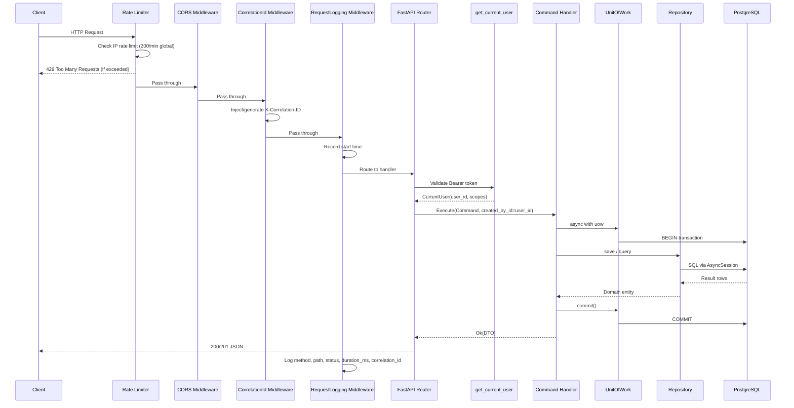
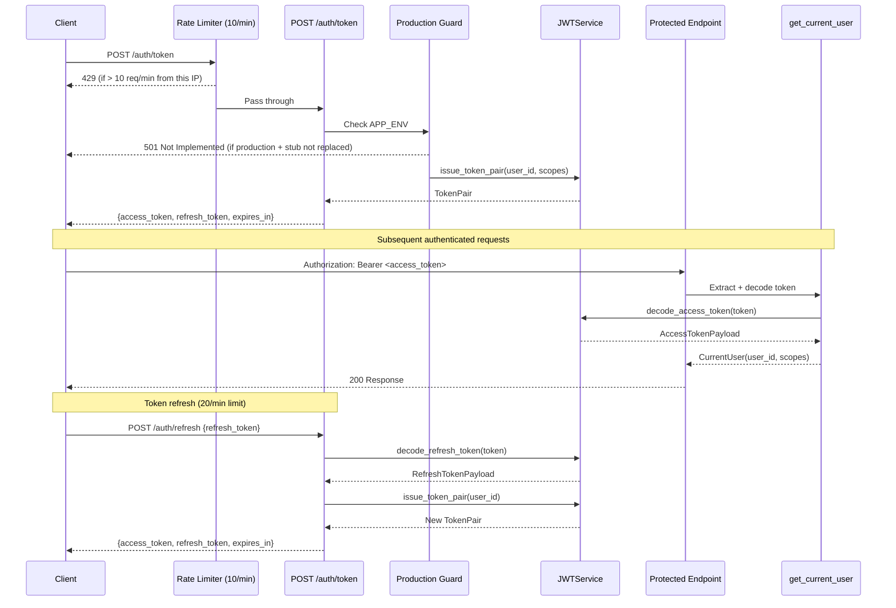
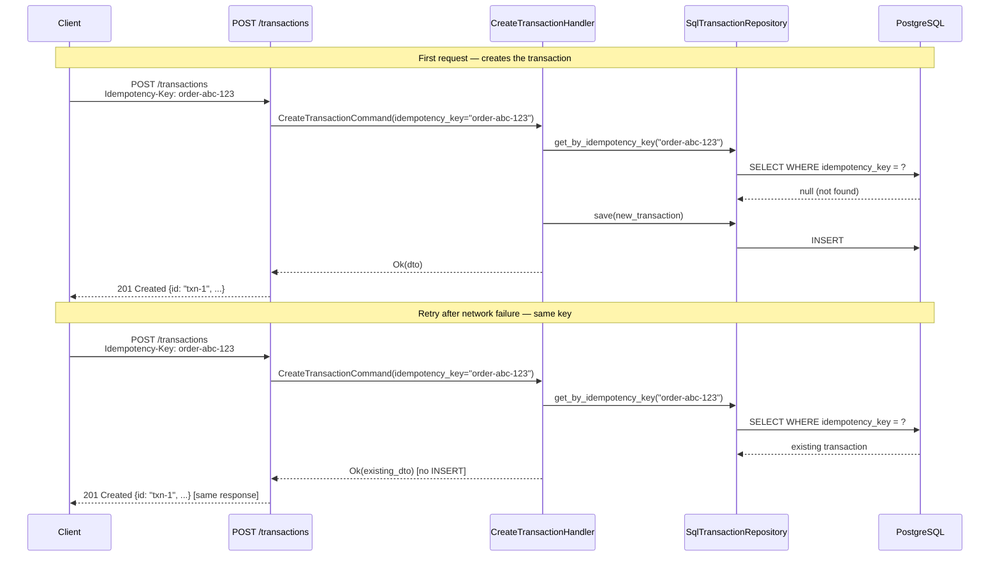

# FastAPI Financial Boilerplate


Production-grade FastAPI boilerplate for financial applications, built with **Domain-Driven Design (DDD)** and **Clean Architecture**. Designed for teams who need a solid, extensible foundation — not a toy scaffold.

---

## Table of Contents

- [Overview](#overview)
- [Financial Safety Guarantees](#financial-safety-guarantees)
- [Tech Stack](#tech-stack)
- [Architecture](#architecture)
  - [Dependency Rule](#dependency-rule)
  - [Layer Responsibilities](#layer-responsibilities)
  - [Request Lifecycle](#request-lifecycle)
  - [Auth Flow](#auth-flow)
  - [Idempotency Flow](#idempotency-flow)
- [Project Structure](#project-structure)
- [Prerequisites](#prerequisites)
- [Quick Start](#quick-start)
  - [1. Create your repo from this template](#1-create-your-repo-from-this-template)
  - [2. Configure environment](#2-configure-environment)
  - [3. Start infrastructure](#3-start-infrastructure)
  - [4. Create the test database](#4-create-the-test-database)
  - [5. Run migrations](#5-run-migrations)
  - [6. Start the server](#6-start-the-server)
- [Environment Variables](#environment-variables)
- [API Reference](#api-reference)
  - [Auth Endpoints](#auth-endpoints)
  - [Transaction Endpoints](#transaction-endpoints)
  - [System Endpoints](#system-endpoints)
- [Security](#security)
- [Running Tests](#running-tests)
- [Database Migrations](#database-migrations)
- [Docker](#docker)
  - [Local Development](#local-development)
  - [Production Build](#production-build)
- [Adding a New Bounded Context](#adding-a-new-bounded-context)
- [Developing with Claude Code](#developing-with-claude-code)
  - [Slash Commands](#slash-commands)
  - [Context-Aware Rule Files](#context-aware-rule-files)
  - [Typical Development Workflow](#typical-development-workflow)
- [Key Design Decisions](#key-design-decisions)
- [Make Commands Reference](#make-commands-reference)
- [Troubleshooting](#troubleshooting)

---

## Overview

This boilerplate provides a complete, runnable backend API skeleton built for **financial-grade reliability**. It enforces strict separation of concerns through Clean Architecture layers, making it easy to:

- Add new bounded contexts (features) without touching existing code
- Swap infrastructure adapters (database, storage, cache) without changing business logic
- Test each layer in isolation — pure unit tests don't need a database
- Scale confidently — async-first throughout, from DB to Redis to GCS

**What's included out of the box:**

| Capability | Implementation |
|---|---|
| REST API | FastAPI with Pydantic v2 validation |
| Database ORM | Async SQLAlchemy 2.0 + asyncpg driver |
| Migrations | Alembic with async-aware env |
| Auth | JWT access + refresh tokens (stateless) |
| Rate limiting | slowapi — 10 req/min on auth, 200 req/min global |
| Object Storage | Google Cloud Storage adapter |
| Caching | Redis (async, connection pooled) |
| Logging | Structured JSON logs via structlog |
| Request tracing | Correlation ID middleware |
| Error tracking | Sentry SDK integration (opt-in via env var) |
| Error handling | Global domain exception → HTTP mapping |
| Containerisation | Multi-stage Dockerfile + docker-compose |
| Linting | Ruff (linter + formatter) |
| Type checking | Mypy (strict mode) |
| Testing | pytest + asyncio + coverage (unit / integration / e2e) |

---

## Financial Safety Guarantees

This boilerplate enforces the following financial-grade properties at every layer. These are not optional — they are baked into the architecture.

### Data Integrity

| Guarantee | Where enforced |
|---|---|
| Monetary amounts are always `Decimal`, never `float` | `Money` value object (domain) + `Mapped[Decimal]` ORM type + `Numeric(19,4)` DB column |
| Amount serialised as `string` in API responses | `TransactionResponse.amount: str` — clients receive `"1500.0000"`, not a JSON number |
| DB-level CHECK: `amount > 0` | `ck_transactions_amount_positive` constraint on `transactions` table |
| DB-level CHECK: currency is valid ISO 4217 | `ck_transactions_currency_iso4217` constraint (`^[A-Z]{3}$`) |
| Optimistic locking prevents lost updates | `version` column; repository validates `version == expected - 1` before writing |

### Immutability & Audit

| Guarantee | Where enforced |
|---|---|
| Financial records are **never hard-deleted** | Soft-delete only — `deleted_at` column; queries always filter `WHERE deleted_at IS NULL` |
| Settled transactions **cannot be modified** | Repository rejects writes to records in `SETTLED` or `REVERSED` status |
| Every write records **who did it** | `created_by_id` / `updated_by_id` sourced from `CurrentUser.user_id` on every mutation |
| Every state change increments `version` | Settle, fail, cancel, soft-delete each call `self._version += 1` |

### Idempotency

| Guarantee | Where enforced |
|---|---|
| Safe to retry on network failure | `Idempotency-Key` request header; UNIQUE constraint on `idempotency_key` column |
| Duplicate request returns original response | `CreateTransactionHandler` checks idempotency key before creating a new record |

### Security

| Guarantee | Where enforced |
|---|---|
| Auth stub is blocked in production | `POST /auth/token` returns `501` if `APP_ENV=production` |
| Rate limiting on auth endpoints | 10 req/min on `/auth/token`, 20 req/min on `/auth/refresh` (per IP) |
| Global rate limiting | 200 req/min default across all routes |
| CORS is explicit, not wildcard | Specific `allow_methods` and `allow_headers` — no `"*"` |
| Production config validated at startup | `_validate_production_config()` fails fast if `DEBUG=True` or GCS unconfigured |
| Health check tests all services | DB, Redis, and GCS are each probed — storage no longer hardcoded to `"ok"` |

---

## Tech Stack

| Layer | Technology | Version |
|---|---|---|
| Language | Python | 3.12 |
| Framework | FastAPI | ≥ 0.115 |
| ASGI Server | Uvicorn + uvloop | ≥ 0.32 |
| ORM | SQLAlchemy (async) | ≥ 2.0 |
| DB Driver | asyncpg | ≥ 0.30 |
| Database | PostgreSQL | 16 |
| Migrations | Alembic | ≥ 1.14 |
| Cache | Redis | 7 |
| Auth | python-jose + passlib | ≥ 3.3 |
| Rate Limiting | slowapi | ≥ 0.1.9 |
| Object Storage | google-cloud-storage | ≥ 2.19 |
| Error Tracking | sentry-sdk | ≥ 2.19 |
| Settings | pydantic-settings | ≥ 2.6 |
| Logging | structlog | ≥ 24.4 |
| Linter | Ruff | ≥ 0.8 |
| Type Checker | Mypy | ≥ 1.13 |
| Test Runner | pytest + pytest-asyncio | ≥ 8.3 |

---

## Architecture

### Dependency Rule

The entire codebase enforces a single rule: **dependencies point inward only.**

```
┌─────────────────────────────────────────────────────────┐
│                      API Layer                          │
│           (FastAPI routers, Pydantic schemas)           │
│                         │                               │
│                         ▼                               │
│                  Application Layer                      │
│          (Command/Query handlers, Use cases)            │
│                         │                               │
│                         ▼                               │
│                    Domain Layer                         │
│      (Entities, Value Objects, Domain Events)           │
│                                                         │
│  Infrastructure implements ──► Ports (interfaces)       │
│  (SQLAlchemy, GCS, Redis, JWT)   defined in Application │
└─────────────────────────────────────────────────────────┘
```

- The **Domain layer** has zero framework imports. It is pure Python.
- The **Application layer** depends only on domain types and abstract ports (`Protocol` classes).
- The **Infrastructure layer** implements the ports — it knows about SQLAlchemy, GCS, Redis.
- The **API layer** wires HTTP requests to application commands/queries and maps results back to HTTP responses.

### Layer Responsibilities

| Layer | Location | Allowed to import | Must NOT import |
|---|---|---|---|
| Domain | `contexts/*/domain/` | Standard library only | FastAPI, SQLAlchemy, Pydantic, Redis |
| Application | `contexts/*/application/` | Domain, `shared/application/` | SQLAlchemy, FastAPI, infrastructure |
| Infrastructure | `contexts/*/infrastructure/`, `infrastructure/` | SQLAlchemy, GCS SDK, Redis | FastAPI routers |
| API | `contexts/*/api/`, `api/` | Application, Infrastructure (via DI) | Domain directly |
| Shared Kernel | `shared/` | Standard library, Pydantic | Any context |

### Request Lifecycle



### Auth Flow



### Idempotency Flow



---

## Project Structure

```
fastapi-boilerplate/
│
├── alembic/                        # Database migration engine
│   ├── env.py                      # Async-aware migration environment
│   ├── script.py.mako              # Migration file template
│   └── versions/                   # Auto-generated migration files (empty at start)
│
├── docker/
│   ├── Dockerfile                  # Multi-stage production build (builder → runtime)
│   └── docker-compose.yml          # Local dev: app + postgres + redis
│
├── scripts/
│   └── start.sh                    # Production entrypoint: migrate then serve
│
├── src/
│   ├── main.py                     # FastAPI app factory, lifespan, Sentry init, rate limiter
│   ├── settings.py                 # Pydantic BaseSettings — single source of config
│   ├── container.py                # Dependency injection container (plain Python)
│   │
│   ├── shared/                     # Shared kernel — used by all bounded contexts
│   │   ├── domain/
│   │   │   ├── base_entity.py      # Entity base: id (UUID), created_at, updated_at
│   │   │   ├── base_aggregate.py   # AggregateRoot: collects domain events
│   │   │   ├── base_value_object.py# Immutable frozen dataclass base
│   │   │   ├── domain_event.py     # Base DomainEvent dataclass
│   │   │   └── value_objects/
│   │   │       ├── money.py        # Money(amount: Decimal, currency: str) — banker's rounding
│   │   │       └── pagination.py   # Pagination, PagedResult[T]
│   │   └── application/
│   │       ├── result.py           # Result[T] = Ok(value) | Err(error) — railway pattern
│   │       └── ports/
│   │           ├── unit_of_work.py # UnitOfWork Protocol — transaction coordination
│   │           └── storage_port.py # StoragePort Protocol — object storage abstraction
│   │
│   ├── infrastructure/             # Concrete adapters — implements ports, no business logic
│   │   ├── auth/
│   │   │   ├── jwt_service.py      # JWTService: issue and decode token pairs
│   │   │   ├── schemas.py          # TokenPair, CurrentUser, AccessTokenPayload
│   │   │   ├── dependencies.py     # get_current_user FastAPI dependency
│   │   │   └── router.py           # POST /auth/token (rate-limited, prod-guarded)
│   │   │                           # POST /auth/refresh (rate-limited)
│   │   ├── database/
│   │   │   ├── base.py             # DeclarativeBase + naming conventions + model registry
│   │   │   ├── engine.py           # create_async_engine, session factory
│   │   │   └── unit_of_work.py     # SqlAlchemyUnitOfWork — session lifecycle
│   │   ├── storage/
│   │   │   └── gcs_storage.py      # GCSStorage — upload, download, signed URLs (async wrapper)
│   │   ├── cache/
│   │   │   └── redis_client.py     # RedisClient — get/set/JSON helpers
│   │   └── http/                   # (reserved) Outbound HTTP client
│   │
│   ├── api/                        # Global API concerns
│   │   ├── router.py               # Root APIRouter + deep health check (DB + Redis + GCS)
│   │   ├── middleware/
│   │   │   ├── correlation_id.py   # Injects X-Correlation-ID per request
│   │   │   ├── request_logging.py  # Structured request/response log
│   │   │   └── error_handler.py    # Domain exceptions → HTTP status codes
│   │   └── schemas/
│   │       ├── health.py           # HealthResponse schema
│   │       └── error.py            # ErrorResponse, ValidationErrorResponse
│   │
│   └── contexts/                   # Bounded contexts — one directory per domain
│       │
│       ├── transactions/           # ✅ Fully implemented example context
│       │   ├── domain/
│       │   │   ├── entities/
│       │   │   │   └── transaction.py        # Transaction aggregate root
│       │   │   │                             #   - version (optimistic locking)
│       │   │   │                             #   - created_by_id / updated_by_id (audit)
│       │   │   │                             #   - deleted_at (soft-delete)
│       │   │   │                             #   - idempotency_key
│       │   │   ├── value_objects/
│       │   │   │   ├── transaction_type.py   # CREDIT | DEBIT | TRANSFER
│       │   │   │   └── transaction_status.py # PENDING | SETTLED | FAILED | CANCELLED | REVERSED
│       │   │   ├── events/
│       │   │   │   └── transaction_events.py # TransactionCreated, Settled, Failed, Cancelled
│       │   │   ├── exceptions.py             # TransactionError hierarchy:
│       │   │   │                             #   InvalidTransactionError
│       │   │   │                             #   TransactionAlreadySettledError
│       │   │   │                             #   TransactionNotFoundError
│       │   │   │                             #   TransactionImmutableError
│       │   │   │                             #   TransactionConcurrentUpdateError
│       │   │   │                             #   DuplicateTransactionError
│       │   │   └── repositories/
│       │   │       └── transaction_repository.py # Abstract repository Protocol
│       │   ├── application/
│       │   │   ├── commands/
│       │   │   │   ├── create_transaction.py # CreateTransactionCommand
│       │   │   │   │                         #   + created_by_id, idempotency_key
│       │   │   │   └── settle_transaction.py # SettleTransactionCommand + settled_by_id
│       │   │   ├── queries/
│       │   │   │   └── list_transactions.py  # ListTransactionsQuery + handler
│       │   │   ├── handlers/
│       │   │   │   ├── create_transaction_handler.py  # Idempotency check + audit log
│       │   │   │   └── settle_transaction_handler.py  # Audit trail + structured log
│       │   │   └── dtos/
│       │   │       └── transaction_dto.py    # Includes version, audit fields, soft-delete
│       │   ├── infrastructure/
│       │   │   ├── models/
│       │   │   │   └── transaction_model.py  # SQLAlchemy ORM:
│       │   │   │                             #   Mapped[Decimal] amount
│       │   │   │                             #   idempotency_key (UNIQUE)
│       │   │   │                             #   created_by_id, updated_by_id
│       │   │   │                             #   deleted_at, version
│       │   │   │                             #   CHECK constraints
│       │   │   │                             #   Composite indexes
│       │   │   └── repositories/
│       │   │       └── sql_transaction_repository.py
│       │   │                             # - Filters soft-deleted on all reads
│       │   │                             # - Blocks writes to SETTLED/REVERSED
│       │   │                             # - Validates version for optimistic lock
│       │   │                             # - get_by_idempotency_key()
│       │   └── api/
│       │       ├── router.py             # POST /transactions (Idempotency-Key header)
│       │       │                         # GET  /transactions?account_id=...&status=...
│       │       │                         # POST /transactions/{id}/settle
│       │       └── schemas/
│       │           ├── request.py        # CreateTransactionRequest
│       │           └── response.py       # TransactionResponse (amount as str)
│       │                                 # TransactionListResponse (paginated)
│       │
│       └── accounts/               # 🔲 Scaffolded — structure ready, implementation empty
│           ├── domain/
│           ├── application/
│           ├── infrastructure/
│           └── api/
│
├── tests/
│   ├── conftest.py                 # Root fixtures: test DB, session, HTTP client
│   ├── unit/                       # Pure Python tests — no DB, no network
│   │   └── domain/
│   │       ├── test_money_value_object.py   # Decimal arithmetic, rounding, immutability
│   │       └── test_transaction_entity.py   # State transitions, version, audit, soft-delete
│   ├── integration/                # Tests against real PostgreSQL
│   │   └── repositories/
│   │       └── test_transaction_repository.py  # Idempotency, immutability, soft-delete, audit
│   └── e2e/                        # Full HTTP stack tests
│       └── test_transaction_endpoints.py
│
├── .env.example                    # All environment variables documented
├── .env.test                       # Test-specific env overrides
├── .python-version                 # Python 3.12 pin
├── .gitignore
├── .dockerignore
├── alembic.ini                     # Alembic configuration
├── pyproject.toml                  # Project metadata + all tool configuration
├── requirements.txt                # Production dependencies
├── requirements-dev.txt            # Dev + test dependencies
└── Makefile                        # Developer shortcuts
```

---

## Prerequisites

Before you begin, make sure the following are installed on your machine:

| Tool | Minimum Version | How to check | Install guide |
|---|---|---|---|
| Python | 3.12 | `python --version` | [python.org](https://www.python.org/downloads/) |
| pip | 24+ | `pip --version` | Bundled with Python |
| Docker | 24+ | `docker --version` | [docs.docker.com](https://docs.docker.com/get-docker/) |
| Docker Compose | 2.20+ | `docker compose version` | Bundled with Docker Desktop |
| Git | any | `git --version` | [git-scm.com](https://git-scm.com/) |

> **Note for Windows users:** Use WSL2 (Windows Subsystem for Linux). Running natively on Windows is not supported.

---

## Quick Start

### 1. Create your repo from this template

Click the **"Use this template"** button at the top of the [GitHub repository page](https://github.com/ridwanspace/fastapi-boilerplate-financial), then choose **"Create a new repository"**.

Once your new repo is created, clone it and install dependencies:

```bash
git clone git@github.com:<your-username>/<your-repo-name>.git
cd <your-repo-name>

# Create and activate a virtual environment
python -m venv .venv
source .venv/bin/activate          # On Windows: .venv\Scripts\activate

# Install all dependencies (including dev/test tools)
make dev
# or manually:
pip install -r requirements-dev.txt
```

### 2. Configure environment

```bash
cp .env.example .env
```

Open `.env` and fill in the required values:

```bash
# Generate a secure JWT secret (minimum 32 chars):
openssl rand -hex 32
```

**Required values to set in `.env`:**

| Variable | How to get it |
|---|---|
| `JWT_SECRET_KEY` | `openssl rand -hex 32` |
| `GCS_PROJECT_ID` | Your GCP project ID |
| `GCS_BUCKET_NAME` | See GCS setup below |
| `GCS_CREDENTIALS_PATH` | Path to your service account JSON file |

**GCS setup — create a service account and bucket:**

```bash
# 1. Create a service account
gcloud iam service-accounts create fastapi-boilerplate-sa \
  --display-name="FastAPI Boilerplate Service Account" \
  --project=<your-project-id>

# 2. Grant GCS and Cloud SQL access
gcloud projects add-iam-policy-binding <your-project-id> \
  --member="serviceAccount:fastapi-boilerplate-sa@<your-project-id>.iam.gserviceaccount.com" \
  --role="roles/storage.admin"

gcloud projects add-iam-policy-binding <your-project-id> \
  --member="serviceAccount:fastapi-boilerplate-sa@<your-project-id>.iam.gserviceaccount.com" \
  --role="roles/cloudsql.client"

# 3. Download the key to the project root (gitignored via *.json)
gcloud iam service-accounts keys create ./service-account.json \
  --iam-account=fastapi-boilerplate-sa@<your-project-id>.iam.gserviceaccount.com

# 4. Create a private GCS bucket
gsutil mb -p <your-project-id> -l asia-southeast1 gs://<your-bucket-name>
```

Then set in `.env`:

```env
GCS_PROJECT_ID=<your-project-id>
GCS_BUCKET_NAME=<your-bucket-name>
GCS_CREDENTIALS_PATH=./service-account.json
```

### 3. Start infrastructure

Start PostgreSQL and Redis locally via Docker:

```bash
docker compose -f docker/docker-compose.yml up -d postgres redis
```

Verify they're running:

```bash
docker compose -f docker/docker-compose.yml ps
```

You should see both `postgres` and `redis` with status `healthy`.

### 4. Create the test database

The test suite requires a separate database. Create it once:

```bash
docker compose -f docker/docker-compose.yml exec postgres \
  psql -U postgres -c "CREATE DATABASE boilerplate_test_db;"
```

### 5. Run migrations

Apply the database schema:

```bash
make migrate
# or:
alembic upgrade head
```

### 6. Start the server

```bash
make run
# or (if make can't find uvicorn — e.g. conda env):
python -m uvicorn src.main:app --host 0.0.0.0 --port 8000 --reload
```

> **conda users:** All `make` targets use `python -m <tool>` so they resolve through the active conda environment automatically.

The API is now running. Open your browser:

| URL | Description |
|---|---|
| http://localhost:8000/docs | Interactive Swagger UI |
| http://localhost:8000/redoc | ReDoc documentation |
| http://localhost:8000/api/v1/health | Health check (DB + Redis + GCS) |

---

## Environment Variables

All configuration is managed through environment variables loaded by `src/settings.py` via Pydantic BaseSettings. Copy `.env.example` to `.env` and customise as needed.

### Application

| Variable | Default | Required | Description |
|---|---|---|---|
| `APP_ENV` | `development` | No | Environment name: `development`, `staging`, `production` |
| `APP_NAME` | `FastAPI Boilerplate` | No | Application name shown in OpenAPI docs |
| `APP_VERSION` | `0.1.0` | No | Application version |
| `DEBUG` | `false` | No | Enable SQLAlchemy query logging. Blocked in production. |
| `LOG_LEVEL` | `INFO` | No | Logging level: `DEBUG`, `INFO`, `WARNING`, `ERROR` |
| `API_PREFIX` | `/api/v1` | No | URL prefix for all API routes |
| `ALLOWED_ORIGINS` | `["http://localhost:3000"]` | No | JSON array of CORS allowed origins |

### Database

| Variable | Default | Required | Description |
|---|---|---|---|
| `DATABASE_URL` | `postgresql+asyncpg://...` | **Yes** | Full async PostgreSQL connection string |
| `DATABASE_POOL_SIZE` | `10` | No | SQLAlchemy connection pool size |
| `DATABASE_MAX_OVERFLOW` | `20` | No | Max extra connections above pool size |
| `DATABASE_POOL_TIMEOUT` | `30` | No | Seconds to wait for a connection |

### Redis

| Variable | Default | Required | Description |
|---|---|---|---|
| `REDIS_URL` | `redis://localhost:6379/0` | **Yes** | Redis connection URL |
| `REDIS_MAX_CONNECTIONS` | `10` | No | Max connections in the pool |

### JWT Authentication

| Variable | Default | Required | Description |
|---|---|---|---|
| `JWT_SECRET_KEY` | — | **Yes** | Signing secret. Minimum 32 characters. Use a random hex string. |
| `JWT_ALGORITHM` | `HS256` | No | JWT signing algorithm |
| `JWT_ACCESS_TOKEN_EXPIRE_MINUTES` | `30` | No | Access token TTL in minutes |
| `JWT_REFRESH_TOKEN_EXPIRE_DAYS` | `7` | No | Refresh token TTL in days |

### Rate Limiting

| Variable | Default | Required | Description |
|---|---|---|---|
| `RATE_LIMIT_DEFAULT` | `200/minute` | No | Global per-IP rate limit across all routes |
| `RATE_LIMIT_AUTH` | `10/minute` | No | Per-IP rate limit on `POST /auth/token` |

### Google Cloud Storage

| Variable | Default | Required | Description |
|---|---|---|---|
| `GCS_PROJECT_ID` | — | Yes (for GCS) | Your GCP project ID |
| `GCS_BUCKET_NAME` | — | Yes (for GCS) | GCS bucket name |
| `GCS_CREDENTIALS_PATH` | — | No | Path to service account JSON file |
| `GCS_CREDENTIALS_JSON` | — | No | Inline service account JSON string (alternative to path) |

> **GCS authentication priority:**
> 1. `GCS_CREDENTIALS_JSON` (inline JSON string) — highest priority
> 2. `GCS_CREDENTIALS_PATH` (path to JSON file)
> 3. Application Default Credentials (ADC) — used automatically on GCP (GKE, Cloud Run, etc.)

```env
# Option 1: path to service account file
GCS_CREDENTIALS_PATH=/path/to/your/service-account.json

# Option 2: inline JSON (useful for CI/CD secrets)
GCS_CREDENTIALS_JSON={"type": "service_account", ...}
```

### Sentry (optional)

| Variable | Default | Required | Description |
|---|---|---|---|
| `SENTRY_DSN` | — | No | Sentry DSN. When set, Sentry is initialised automatically at startup. |

---

## API Reference

All endpoints are prefixed with `/api/v1`.

### Auth Endpoints

> **Rate limited:** `POST /auth/token` — 10 requests/minute per IP. `POST /auth/refresh` — 20 requests/minute per IP.

#### `POST /api/v1/auth/token` — Issue token pair

Request:
```json
{
  "username": "demo",
  "password": "demo"
}
```

Response `200 OK`:
```json
{
  "access_token": "eyJ...",
  "refresh_token": "eyJ...",
  "token_type": "bearer",
  "expires_in": 1800
}
```

> **Important — Production behaviour:** In `APP_ENV=production` this endpoint returns `501 Not Implemented` until you wire a real user repository. Replace the stub in `src/infrastructure/auth/router.py`. The demo credentials (`demo/demo`) work only in `development` and `staging`.

---

#### `POST /api/v1/auth/refresh` — Refresh token pair

Request:
```json
{
  "refresh_token": "eyJ..."
}
```

Response `200 OK`: same structure as token issuance.

---

### Transaction Endpoints

All transaction endpoints require a valid Bearer token.

```
Authorization: Bearer <access_token>
```

#### `POST /api/v1/transactions` — Create a transaction

Supports idempotent retries via `Idempotency-Key` header. Safe to retry on network failure — a repeated request with the same key returns the original response without creating a duplicate.

**Headers:**

| Header | Required | Description |
|---|---|---|
| `Authorization` | **Yes** | `Bearer <access_token>` |
| `Idempotency-Key` | Recommended | Client-generated unique key (e.g. UUID). Prevents double-spend on retry. |

**Request:**
```json
{
  "account_id": "550e8400-e29b-41d4-a716-446655440000",
  "amount": "1500.00",
  "currency": "USD",
  "transaction_type": "credit",
  "reference": "SALARY-2026-03"
}
```

**Response `201 Created`:**
```json
{
  "id": "a1b2c3d4-...",
  "account_id": "550e8400-...",
  "amount": "1500.0000",
  "currency": "USD",
  "transaction_type": "credit",
  "status": "pending",
  "reference": "SALARY-2026-03",
  "idempotency_key": "my-client-key-001",
  "failure_reason": null,
  "settled_at": null,
  "version": 0,
  "created_at": "2026-03-15T10:00:00Z",
  "updated_at": "2026-03-15T10:00:00Z"
}
```

> **Note:** `amount` is always returned as a **decimal string** (e.g. `"1500.0000"`), not a JSON number, to guarantee precision is preserved for all clients.

**Transaction types:** `credit` | `debit` | `transfer`

---

#### `GET /api/v1/transactions` — List transactions

**Query parameters:**

| Parameter | Required | Default | Description |
|---|---|---|---|
| `account_id` | **Yes** | — | Filter by account ID (UUID) |
| `page` | No | `1` | Page number (1-indexed) |
| `page_size` | No | `20` | Results per page (max 100) |
| `status` | No | — | Filter by status: `pending`, `settled`, `failed`, `cancelled` |

**Response `200 OK`:**
```json
{
  "items": [...],
  "total": 42,
  "page": 1,
  "page_size": 20,
  "total_pages": 3,
  "has_next": true,
  "has_previous": false
}
```

---

#### `POST /api/v1/transactions/{transaction_id}/settle` — Settle a transaction

Records `settled_by_id` from the authenticated user automatically.

**Response `200 OK`:** same structure as create, with `status: "settled"`, `settled_at` populated, and `version` incremented to `1`.

**Error responses:**

| Status | When |
|---|---|
| `401 Unauthorized` | Missing or invalid Bearer token |
| `404 Not Found` | Transaction ID does not exist or is soft-deleted |
| `409 Conflict` | Transaction is already settled/cancelled/failed (immutable) |
| `409 Conflict` | Concurrent update detected (optimistic lock) — client should retry |
| `400 Bad Request` | Other domain validation failure |

---

### System Endpoints

#### `GET /api/v1/health` — Deep health check

Probes all three downstream services. Does not require authentication.

Response `200 OK`:
```json
{
  "status": "ok",
  "version": "0.1.0",
  "environment": "development",
  "services": {
    "database": "ok",
    "redis": "ok",
    "storage": "ok"
  }
}
```

`status` is `"ok"` when all services are healthy, `"degraded"` when one or more are unavailable (individual service statuses show which).

---

## Security

### Auth stub in production

`POST /auth/token` is intentionally blocked in production (`APP_ENV=production`) until a real user repository is wired:

```python
# src/infrastructure/auth/router.py
if settings.is_production:
    raise HTTPException(status_code=501, detail="Authentication backend not configured.")
```

To implement real auth: replace the stub in `src/infrastructure/auth/router.py` with a lookup against your users table, validate the password with `passlib`, and return the token pair.

### Rate limiting

| Endpoint | Limit | Scope |
|---|---|---|
| `POST /auth/token` | 10 requests/minute | Per IP |
| `POST /auth/refresh` | 20 requests/minute | Per IP |
| All other routes | 200 requests/minute | Per IP (global default) |

Exceeded limits return `429 Too Many Requests`.

### Idempotency

All mutation endpoints that could cause financial harm support idempotency via the `Idempotency-Key` request header. Send a unique client-generated key (e.g. a UUID) with each request. If you retry with the same key, the original response is returned without re-executing the operation.

```bash
curl -X POST /api/v1/transactions \
  -H "Idempotency-Key: $(uuidgen)" \
  -H "Authorization: Bearer ..." \
  -d '{"amount": "500.00", ...}'
```

### Production startup validation

On startup, `_validate_production_config()` checks:
- `DEBUG` must be `False`
- `GCS_PROJECT_ID` must be set
- `GCS_BUCKET_NAME` must be set

The application refuses to start if any check fails.

### CORS

CORS is configured with explicit allowed methods and headers — no wildcards:

```python
allow_methods=["GET", "POST", "PUT", "PATCH", "DELETE", "OPTIONS"]
allow_headers=["Authorization", "Content-Type", "X-Correlation-ID", "Idempotency-Key"]
```

---

## Running Tests

Tests are organised into three tiers with pytest markers.

```bash
# Run all tests with coverage report
make test

# Run only unit tests (no external dependencies — fastest)
make test-unit

# Run only integration tests (requires PostgreSQL)
make test-integration

# Run only e2e tests (requires running app + PostgreSQL)
make test-e2e
```

### Test tiers explained

| Tier | Marker | Speed | Requires | What it tests |
|---|---|---|---|---|
| Unit | `@pytest.mark.unit` | ~100ms total | Nothing | Domain logic, Money arithmetic, transaction state machine, version increments, soft-delete |
| Integration | `@pytest.mark.integration` | ~2–10s | PostgreSQL | Repository: idempotency, immutability enforcement, soft-delete filtering, audit fields, optimistic locking |
| E2E | `@pytest.mark.e2e` | ~5–30s | PostgreSQL + Redis | Full HTTP stack from request to response, auth requirements |

### How integration test isolation works

Integration tests do **not** recreate the database schema between tests. Instead, each test runs inside a transaction that is rolled back at teardown. This is 10–50× faster than truncating tables.

```
Session begins
  └─ BEGIN transaction (before each test)
       └─ test runs — inserts, updates, queries
  └─ ROLLBACK (after each test — changes discarded)
Session ends
```

### Running a specific test

```bash
# All tests in a file
pytest tests/unit/domain/test_transaction_entity.py -v

# A specific test by name
pytest tests/unit/domain/test_transaction_entity.py -v -k "test_settle_increments_version"

# All tests matching a keyword
pytest -v -k "idempotency"
```

### Coverage report

After `make test`, an HTML report is generated at `htmlcov/index.html`:

```bash
open htmlcov/index.html       # macOS
xdg-open htmlcov/index.html   # Linux
```

---

## Database Migrations

Migrations are managed by Alembic. The `alembic/env.py` is configured for async SQLAlchemy.

### Apply all pending migrations

```bash
make migrate
# or:
python -m alembic upgrade head
```

### Create a new migration

After modifying or adding a SQLAlchemy model, generate the migration automatically:

```bash
make migrate-create msg="add payment_method to transactions"
# or:
python -m alembic revision --autogenerate -m "add payment_method to transactions"
```

> **Important:** Always review the generated file in `alembic/versions/` before applying. Autogenerate may miss some changes (e.g. check constraints defined only at the Python level, custom PostgreSQL types).

### Other useful migration commands

```bash
python -m alembic current          # Show current applied revision
python -m alembic history          # Show migration history
python -m alembic downgrade -1     # Rollback one migration
python -m alembic downgrade base   # Rollback all migrations (⚠️ destructive)
```

### Registering new models

When you add a new SQLAlchemy model, register it in `src/infrastructure/database/base.py` so Alembic can detect it:

```python
def import_all_models() -> None:
    from src.contexts.transactions.infrastructure.models import transaction_model  # noqa: F401
    # Add your new model import here ↓
    from src.contexts.payments.infrastructure.models import payment_model  # noqa: F401
```

> **Note:** Only import models for contexts that have been implemented. Importing a non-existent module will cause a mypy error at startup.

### Financial model conventions

Every financial ORM model should include these columns by default:

```python
# Audit trail
created_by_id: Mapped[uuid.UUID | None] = mapped_column(Uuid, nullable=True)
updated_by_id: Mapped[uuid.UUID | None] = mapped_column(Uuid, nullable=True)

# Soft-delete — never hard-delete financial records
deleted_at: Mapped[datetime | None] = mapped_column(DateTime(timezone=True), nullable=True)

# Optimistic locking
version: Mapped[int] = mapped_column(nullable=False, default=0)
```

---

## Docker

### Local Development

The `docker-compose.yml` starts **PostgreSQL** and **Redis** with health checks, plus the **app** with hot-reload:

```bash
# Start everything
make docker-up

# Stop everything
make docker-down

# View logs
docker compose -f docker/docker-compose.yml logs -f app

# View only postgres logs
docker compose -f docker/docker-compose.yml logs -f postgres
```

**Services and ports:**

| Service | Port | Credentials |
|---|---|---|
| FastAPI app | `8000` | — |
| PostgreSQL | `5432` | `postgres` / `postgres` |
| Redis | `6379` | no password |

### Production Build

The production Dockerfile uses a **multi-stage build** to produce a minimal, secure image:

```
Stage 1 (builder)             Stage 2 (runtime)
─────────────────             ─────────────────
python:3.12-slim              python:3.12-slim
+ gcc, libpq-dev              + libpq5 only (runtime lib)
+ pip install wheels    ───►  + compiled wheels (no pip, no build tools)
                              + non-root user: appuser
                              + health check every 30s
                              + CMD: start.sh (migrate then serve)
```

Build and run the production image:

```bash
# Build the image
docker build -f docker/Dockerfile -t <your-repo-name>:latest .

# Run it (pass your env values)
docker run -p 8000:8000 \
  --env-file .env \
  -e DATABASE_URL=postgresql+asyncpg://... \
  <your-repo-name>:latest
```

**Security properties of the production image:**
- Runs as non-root user (`appuser`)
- No `pip`, no compiler, no build tools in the runtime layer
- Source code limited to `src/`, `alembic/`, `scripts/`
- No secrets baked in — all injected via environment variables at runtime
- Health check polls `/api/v1/health` every 30 seconds

---

## Adding a New Bounded Context

Follow these steps to add a new domain context (e.g. `payments`). The `accounts/` context is already scaffolded as a reference. The `transactions/` context is the full working example to copy patterns from.

### Step 1 — Create the directory structure

```bash
mkdir -p src/contexts/payments/{domain/{entities,value_objects,events,repositories},application/{commands,queries,handlers,dtos},infrastructure/{models,repositories},api/schemas}

# Create __init__.py in every directory
find src/contexts/payments -type d | xargs -I{} touch {}/__init__.py
```

### Step 2 — Define the domain

Create your aggregate root in `src/contexts/payments/domain/entities/payment.py`. Always include audit fields and version in the domain entity:

```python
from src.shared.domain.base_aggregate import AggregateRoot
from src.shared.domain.value_objects.money import Money

class Payment(AggregateRoot):
    def __init__(self, amount: Money, created_by_id: uuid.UUID | None = None, ...) -> None:
        super().__init__()
        self._created_by_id = created_by_id
        self._updated_by_id = created_by_id
        self._deleted_at = None
        self._version = 0
        # enforce your invariants here
```

### Step 3 — Define the abstract repository

In `src/contexts/payments/domain/repositories/payment_repository.py`:

```python
from typing import Protocol
import uuid
from src.contexts.payments.domain.entities.payment import Payment

class PaymentRepository(Protocol):
    async def save(self, payment: Payment) -> None: ...
    async def get_by_id(self, payment_id: uuid.UUID) -> Payment | None: ...
```

### Step 4 — Create the SQLAlchemy model

In `src/contexts/payments/infrastructure/models/payment_model.py`. Always include the financial model conventions (audit, soft-delete, version, check constraints):

```python
from decimal import Decimal
from src.infrastructure.database.base import Base

class PaymentModel(Base):
    __tablename__ = "payments"

    amount: Mapped[Decimal] = mapped_column(Numeric(19, 4), nullable=False)
    created_by_id: Mapped[uuid.UUID | None] = mapped_column(Uuid, nullable=True)
    updated_by_id: Mapped[uuid.UUID | None] = mapped_column(Uuid, nullable=True)
    deleted_at: Mapped[datetime | None] = mapped_column(DateTime(timezone=True), nullable=True)
    version: Mapped[int] = mapped_column(nullable=False, default=0)

    __table_args__ = (
        CheckConstraint("amount > 0", name="ck_payments_amount_positive"),
    )
```

Register the model in `src/infrastructure/database/base.py`:

```python
def import_all_models() -> None:
    ...
    from src.contexts.payments.infrastructure.models import payment_model  # noqa: F401
```

### Step 5 — Create and apply a migration

```bash
make migrate-create msg="add payments table"
# Review the generated file in alembic/versions/
alembic upgrade head
```

### Step 6 — Implement the repository and handlers

Copy the patterns from:
- `src/contexts/transactions/infrastructure/repositories/sql_transaction_repository.py` — immutability guard, soft-delete filter, version check
- `src/contexts/transactions/application/handlers/create_transaction_handler.py` — idempotency, audit logging

### Step 7 — Create the API router

In `src/contexts/payments/api/router.py`, create your `APIRouter`. Pass `current_user.user_id` as `created_by_id` on every mutation. Then register in `src/api/router.py`:

```python
from src.contexts.payments.api.router import router as payments_router
api_router.include_router(payments_router)
```

### Step 8 — Write tests

| Test file | What to cover |
|---|---|
| `tests/unit/domain/test_payment_entity.py` | State transitions, version increments, invariant enforcement, soft-delete |
| `tests/integration/repositories/test_payment_repository.py` | Idempotency, immutability, soft-delete filtering, audit fields |
| `tests/e2e/test_payment_endpoints.py` | Auth required, correct HTTP status codes |

---

## Developing with Claude Code

This project ships with a `.claude/` configuration directory that makes Claude Code context-aware of the architecture, financial rules, and team conventions. When you open this project in Claude Code, it automatically enforces the right rules for the layer you are editing.

### Slash Commands

Three custom slash commands are available in Claude Code:

| Command | Usage | What it does |
|---|---|---|
| `/plan` | `/plan <feature description>` | Researches the codebase, then generates a structured implementation plan saved to `docs/plan/`. Includes tasks, acceptance criteria, unit/integration test lists, financial safety checklist, and architecture compliance checklist. |
| `/run-plan` | `/run-plan <plan-file> <task-id>` | Executes a single task from a plan file. Reads the plan, explores the codebase, implements the code, writes the specified tests, runs format/lint/typecheck/tests, and updates the plan file with progress. |
| `/commit` | `/commit [message hint]` | Runs `format → lint → typecheck → unit tests` in order, reviews the staged diff for financial safety violations, drafts a conventional commit message, and commits only after your confirmation. |

**Example workflow:**

```bash
# 1. Ask Claude to plan a new feature
/plan add wallet balance tracking with multi-currency support

# 2. Execute tasks one by one from the generated plan
/run-plan docs/plan/00-wallet-balance.md 1.1
/run-plan docs/plan/00-wallet-balance.md 1.2

# 3. Commit when ready
/commit
```

### Context-Aware Rule Files

The `.claude/rules/` directory contains layer-specific guidelines that Claude Code loads automatically based on which files you are editing:

| Rule File | Auto-loaded when editing | What it enforces |
|---|---|---|
| `rules/domain.md` | `src/contexts/*/domain/**/*.py` | Zero framework imports, state transition pattern, `Money` arithmetic, event collection |
| `rules/application.md` | `src/contexts/*/application/**/*.py` | `Result[T]` return type, UoW usage, idempotency check before INSERT, audit trail |
| `rules/infrastructure.md` | `src/contexts/*/infrastructure/**/*.py` | `Numeric(19,4)` for money, optimistic locking validation, soft-delete filter on all SELECTs |
| `rules/api.md` | `src/contexts/*/api/**/*.py` | `Idempotency-Key` header, domain exception → HTTP mapping, `amount` as `str` in responses |
| `rules/migrations.md` | `alembic/**/*.py` | Required financial columns, column rename strategy, autogenerate review checklist |
| `rules/security.md` | **All files** | No hard-coded credentials, CORS whitelist, no f-string SQL, signed URL expiry |
| `rules/testing.md` | `tests/**/*.py` | Test marker discipline, no DB mocks in integration tests, naming conventions |

You do not need to reference these manually — Claude Code picks them up based on the file path.

### Typical Development Workflow

```
1. /plan <new feature>          → plan saved to docs/plan/NN-feature.md
2. /run-plan <plan> <task-1.1>  → domain entity created + unit tests passing
3. /run-plan <plan> <task-1.2>  → application handler created + tests passing
4. /run-plan <plan> <task-1.3>  → repository + integration tests passing
5. /run-plan <plan> <task-1.4>  → API router created + e2e tests passing
6. /commit                      → format, lint, typecheck, unit tests, then commit
```

The `/run-plan` command updates the plan file after each task, tracking progress with `[x]` checkboxes and an execution log at the bottom of the file.

---

## Key Design Decisions

### Money is always `Decimal` — end to end

Financial amounts flow as `Decimal` from the API request through every layer down to the database and back:

```
Request (Pydantic Decimal) → Command (Decimal) → Money VO (Decimal)
  → ORM (Mapped[Decimal] + Numeric(19,4)) → DB (PostgreSQL numeric)
  → back to Money → DTO (Decimal) → Response (str "1500.0000")
```

The response serialises amount as a **string** so that JSON clients (JavaScript, in particular) never silently lose precision when parsing numbers.

```python
# Always use Money.of() — never raw float
amount = Money.of("1500.50", "USD")   # ✅
amount = Money(amount=1500.50, ...)   # ❌ float — precision loss
```

### Optimistic locking prevents lost updates

Each financial record has a `version` column starting at `0`. Every state transition increments it. The repository validates the version before writing:

```
User A reads transaction (version=0)
User B reads transaction (version=0)
User A settles → version becomes 1 → saved OK
User B tries to settle → expects version=0, but DB has version=1 → raises TransactionConcurrentUpdateError
```

The API returns `409 Conflict`. The client should re-fetch and retry if still appropriate.

### Immutability after terminal states

Once a transaction reaches `SETTLED` or `REVERSED`, the repository refuses any further updates at the persistence level — not just the domain level:

```python
_IMMUTABLE_STATUSES = {TransactionStatus.SETTLED, TransactionStatus.REVERSED}

if TransactionStatus(model.status) in _IMMUTABLE_STATUSES:
    raise TransactionImmutableError(...)
```

This is defence-in-depth: even if domain logic were bypassed, the record is protected.

### Soft-delete only — financial records are permanent

Hard-delete (`DELETE FROM transactions`) is never used. All reads filter `WHERE deleted_at IS NULL`:

```python
stmt = select(TransactionModel).where(
    TransactionModel.deleted_at.is_(None),
)
```

Soft-deleted records remain in the database for audit and regulatory purposes.

### Idempotency key as a UNIQUE constraint

The `idempotency_key` column has a database-level `UNIQUE` constraint. Even if the application-level check is bypassed or two requests race, the database will reject the second INSERT, preventing double-spend.

### Result type (railway pattern)

Application handlers return `Result[T]` — never raise. Error flow is explicit:

```python
# Handler returns:
return Ok(dto)                       # success
return Err(TransactionNotFoundError) # known failure

# Router maps to HTTP:
if result.is_err():
    error = result.unwrap()
    if isinstance(error, TransactionNotFoundError):
        raise HTTPException(status_code=404, ...)
```

No domain exceptions leak through layer boundaries unhandled.

### UnitOfWork owns the session

Repositories are given the session by the UnitOfWork, not the container. This means a handler can use multiple repositories in a single atomic transaction:

```python
async with self._uow as uow:
    account_repo = SqlAccountRepository(uow.session)
    txn_repo = SqlTransactionRepository(uow.session)
    # both repositories share the SAME session → one atomic commit
    await uow.commit()
```

### Plain Python DI container

No DI framework. `container.py` is a plain class. Easy to override in tests:

```python
# In test conftest:
from src.container import container
container._jwt = FakeJWTService()
```

---

## Make Commands Reference

| Command | Description |
|---|---|
| `make help` | Show all available commands |
| `make install` | Install production dependencies only |
| `make dev` | Install all dependencies (production + dev + test tools) |
| `make run` | Start the dev server with hot reload on port 8000 |
| `make test` | Run all tests with coverage report |
| `make test-unit` | Run unit tests only (fast, no external dependencies) |
| `make test-integration` | Run integration tests (requires PostgreSQL) |
| `make test-e2e` | Run end-to-end tests (requires full stack) |
| `make lint` | Run Ruff linter on `src/` and `tests/` |
| `make format` | Auto-format and fix lint issues with Ruff |
| `make typecheck` | Run Mypy strict type checking on `src/` |
| `make migrate` | Apply all pending Alembic migrations |
| `make migrate-create msg="..."` | Create a new autogenerated migration |
| `make docker-up` | Start local dev stack (postgres + redis + app) |
| `make docker-down` | Stop and remove local dev containers |

---

## Troubleshooting

### `make: uvicorn: No such file or directory`

**Symptom:** `make run` (or any make target) fails with `No such file or directory`.

**Cause:** `make` runs in a clean shell that doesn't inherit conda environment activation. The tool binaries are not on its `PATH`.

**Fix:** All Makefile targets already use `python -m <tool>` to resolve through the active Python. Make sure your conda environment is activated before running `make`:

```bash
conda activate <your-env>
make run
```

---

### `ALLOWED_ORIGINS` parse error on startup

**Symptom:** `pydantic_settings.exceptions.SettingsError: error parsing value for field "allowed_origins"`

**Cause:** pydantic-settings v2 parses `list[str]` fields as JSON. A bare comma-separated string is not valid JSON.

**Fix:** Use a JSON array in your `.env`:

```env
# ✅ Correct
ALLOWED_ORIGINS=["http://localhost:3000","http://localhost:8080"]

# ❌ Wrong — fails to parse
ALLOWED_ORIGINS=http://localhost:3000,http://localhost:8080
```

---

### `Connection refused` on startup

**Symptom:** The app crashes immediately with a database or Redis connection error.

**Fix:** Make sure the infrastructure containers are running and healthy:

```bash
docker compose -f docker/docker-compose.yml ps
# Both postgres and redis should show status: healthy

# If not started:
make docker-up
```

---

### `JWT_SECRET_KEY` validation error

**Symptom:** `pydantic_core.ValidationError: JWT_SECRET_KEY: String should have at least 32 characters`

**Fix:** Generate a proper secret and set it in `.env`:

```bash
python -c "import secrets; print(secrets.token_hex(32))"
# Copy the output into JWT_SECRET_KEY in your .env
```

---

### `501 Not Implemented` on `POST /auth/token`

**Symptom:** Auth endpoint returns 501 in production.

**Cause:** The credential stub is intentionally blocked when `APP_ENV=production`.

**Fix:** Implement real user validation in `src/infrastructure/auth/router.py`:

```python
# Replace the stub block with:
user = await user_repository.get_by_username(body.username)
if not user or not verify_password(body.password, user.hashed_password):
    raise HTTPException(status_code=401, detail="Invalid credentials")
return jwt_service.issue_token_pair(user_id=user.id, scopes=user.scopes)
```

---

### `409 Conflict` on settle — concurrent update

**Symptom:** Settle request returns 409 with "modified concurrently".

**Cause:** Another request modified the transaction between your read and write (optimistic locking).

**Fix:** Re-fetch the transaction and retry the settle if it is still in `pending` status.

---

### Alembic `Target database is not up to date`

**Fix:**

```bash
alembic upgrade head
```

If out of sync:

```bash
alembic current    # check current revision
alembic history    # check available revisions
```

---

### `asyncpg.exceptions.UndefinedTableError`

**Symptom:** SQLAlchemy queries fail with "relation does not exist".

**Fix:** You haven't run migrations yet:

```bash
make migrate
```

---

### Tests fail with `FATAL: database "boilerplate_test_db" does not exist`

**Fix:** Create the test database:

```bash
docker compose -f docker/docker-compose.yml exec postgres \
  psql -U postgres -c "CREATE DATABASE boilerplate_test_db;"
```

---

### Mypy errors on third-party libraries

Mypy runs in strict mode. Libraries without type stubs need to be suppressed explicitly in `pyproject.toml`:

```toml
[[tool.mypy.overrides]]
module = ["your_library.*"]
ignore_missing_imports = true
```

---

### GCS `DefaultCredentialsError`

**Symptom:** `google.auth.exceptions.DefaultCredentialsError` on startup.

**Fix:** Set one of the GCS auth options in `.env`:

```env
# Option 1: path to service account file
GCS_CREDENTIALS_PATH=/path/to/service-account.json

# Option 2: inline JSON (useful for secrets managers / CI)
GCS_CREDENTIALS_JSON={"type": "service_account", ...}

# Option 3: running on GCP (GKE, Cloud Run) — leave both empty, ADC is used automatically
```

---

### Health check shows `storage: unavailable`

**Symptom:** `/api/v1/health` returns `storage: "unavailable"` even though GCS is configured.

**Cause:** The health check performs a real `exists()` probe against GCS. It will fail if credentials are wrong, the bucket doesn't exist, or GCS is unreachable.

**Fix:** Verify your GCS credentials and bucket name:

```bash
# Test with gcloud CLI
gcloud storage ls gs://your-bucket-name

# Or check the app logs for the specific GCS error
docker compose -f docker/docker-compose.yml logs app | grep gcs
```

---

*Built with FastAPI · Python 3.12 · Clean Architecture · DDD*
