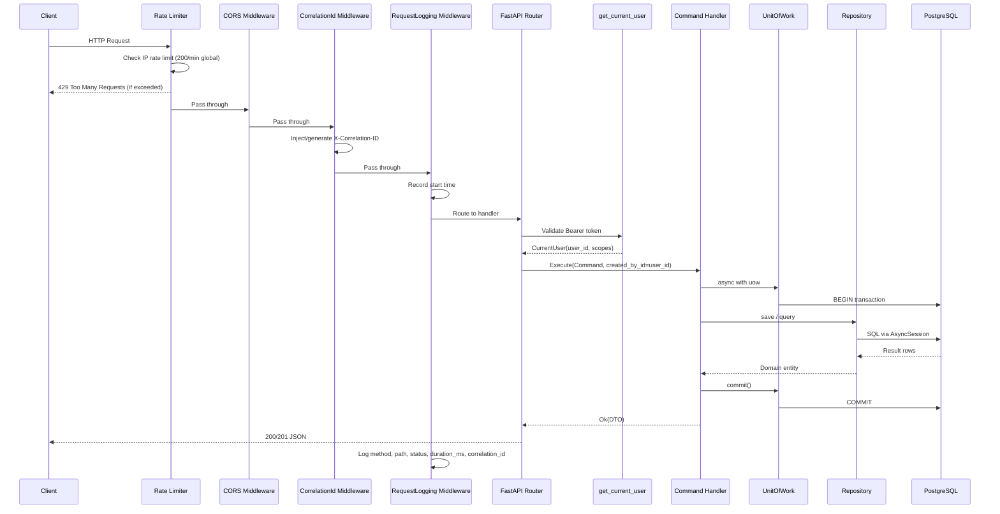
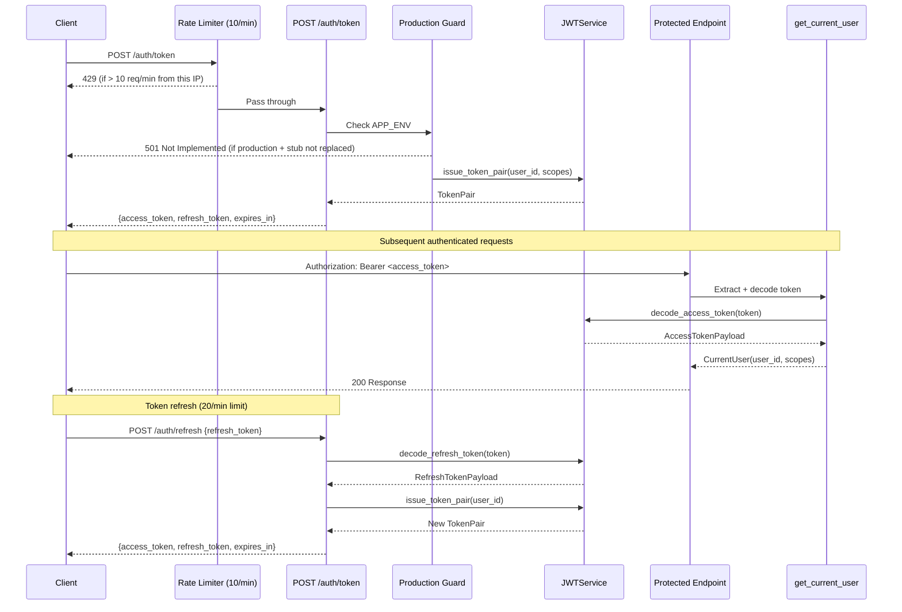
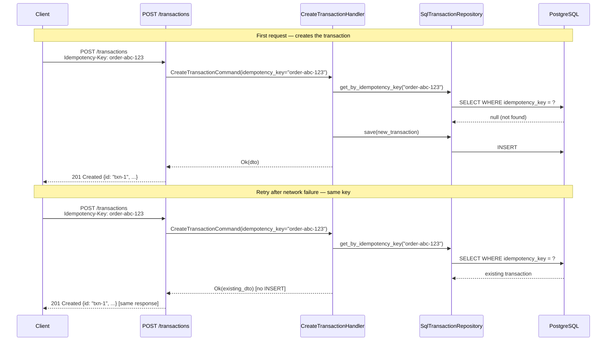

# Architecture

> **Navigation:** [README](../../README.md) · [Getting Started](getting-started.md) · [Adding a Bounded Context](adding-a-bounded-context.md) · [API Reference](api-reference.md)

---

## Table of Contents

- [Overview](#overview)
- [Financial Safety Guarantees](#financial-safety-guarantees)
- [Dependency Rule](#dependency-rule)
- [Layer Responsibilities](#layer-responsibilities)
- [Request Lifecycle](#request-lifecycle)
- [Auth Flow](#auth-flow)
- [Idempotency Flow](#idempotency-flow)
- [Project Structure](#project-structure)
- [Key Design Decisions](#key-design-decisions)

---

## Overview

This boilerplate provides a complete, runnable backend API skeleton built for **financial-grade reliability**. It enforces strict separation of concerns through Clean Architecture layers, making it easy to:

- Add new bounded contexts (features) without touching existing code
- Swap infrastructure adapters (database, storage, cache) without changing business logic
- Test each layer in isolation — pure unit tests don't need a database
- Scale confidently — async-first throughout, from DB to Redis to GCS

---

## Financial Safety Guarantees

These are non-negotiable architectural constraints baked into every layer.

### Data Integrity

| Guarantee | Where enforced |
|---|---|
| Monetary amounts are always `Decimal`, never `float` | `Money` value object (domain) + `Mapped[Decimal]` ORM type + `Numeric(19,4)` DB column |
| Amount serialised as `string` in API responses | `TransactionResponse.amount: str` — clients receive `"1500.0000"`, not a JSON number |
| DB-level CHECK: `amount > 0` | `ck_transactions_amount_positive` constraint on `transactions` table |
| DB-level CHECK: currency is valid ISO 4217 | `ck_transactions_currency_iso4217` constraint (`^[A-Z]{3}$`) |
| Optimistic locking prevents lost updates | `version` column; repository validates `version == expected - 1` before writing |

### Immutability & Audit

| Guarantee | Where enforced |
|---|---|
| Financial records are **never hard-deleted** | Soft-delete only — `deleted_at` column; queries always filter `WHERE deleted_at IS NULL` |
| Settled transactions **cannot be modified** | Repository rejects writes to records in `SETTLED` or `REVERSED` status |
| Every write records **who did it** | `created_by_id` / `updated_by_id` sourced from `CurrentUser.user_id` on every mutation |
| Every state change increments `version` | Settle, fail, cancel, soft-delete each call `self._version += 1` |

### Idempotency

| Guarantee | Where enforced |
|---|---|
| Safe to retry on network failure | `Idempotency-Key` request header; UNIQUE constraint on `idempotency_key` column |
| Duplicate request returns original response | `CreateTransactionHandler` checks idempotency key before creating a new record |

### Security

| Guarantee | Where enforced |
|---|---|
| Auth stub is blocked in production | `POST /auth/token` returns `501` if `APP_ENV=production` |
| Rate limiting on auth endpoints | 10 req/min on `/auth/token`, 20 req/min on `/auth/refresh` (per IP) |
| Global rate limiting | 200 req/min default across all routes |
| CORS is explicit, not wildcard | Specific `allow_methods` and `allow_headers` — no `"*"` |
| Production config validated at startup | `_validate_production_config()` fails fast if `DEBUG=True` or GCS unconfigured |
| Health check tests all services | DB, Redis, and GCS are each probed — storage no longer hardcoded to `"ok"` |

---

## Dependency Rule

The entire codebase enforces a single rule: **dependencies point inward only.**

```
┌─────────────────────────────────────────────────────────┐
│                      API Layer                          │
│           (FastAPI routers, Pydantic schemas)           │
│                         │                               │
│                         ▼                               │
│                  Application Layer                      │
│          (Command/Query handlers, Use cases)            │
│                         │                               │
│                         ▼                               │
│                    Domain Layer                         │
│      (Entities, Value Objects, Domain Events)           │
│                                                         │
│  Infrastructure implements ──► Ports (interfaces)       │
│  (SQLAlchemy, GCS, Redis, JWT)   defined in Application │
└─────────────────────────────────────────────────────────┘
```

- The **Domain layer** has zero framework imports. It is pure Python.
- The **Application layer** depends only on domain types and abstract ports (`Protocol` classes).
- The **Infrastructure layer** implements the ports — it knows about SQLAlchemy, GCS, Redis.
- The **API layer** wires HTTP requests to application commands/queries and maps results back to HTTP responses.

See [Adding a Bounded Context](adding-a-bounded-context.md) to see how this plays out in practice.

---

## Layer Responsibilities

| Layer | Location | Allowed to import | Must NOT import |
|---|---|---|---|
| Domain | `contexts/*/domain/` | Standard library only | FastAPI, SQLAlchemy, Pydantic, Redis |
| Application | `contexts/*/application/` | Domain, `shared/application/` | SQLAlchemy, FastAPI, infrastructure |
| Infrastructure | `contexts/*/infrastructure/`, `infrastructure/` | SQLAlchemy, GCS SDK, Redis | FastAPI routers |
| API | `contexts/*/api/`, `api/` | Application, Infrastructure (via DI) | Domain directly |
| Shared Kernel | `shared/` | Standard library, Pydantic | Any context |

---

## Request Lifecycle



---

## Auth Flow



---

## Idempotency Flow



See [API Reference — Idempotency](api-reference.md#idempotency) for usage examples.

---

## Project Structure

```
fastapi-boilerplate/
│
├── alembic/                        # Database migration engine
│   ├── env.py                      # Async-aware migration environment
│   ├── script.py.mako              # Migration file template
│   └── versions/                   # Auto-generated migration files (empty at start)
│
├── docker/
│   ├── Dockerfile                  # Multi-stage production build (builder → runtime)
│   └── docker-compose.yml          # Local dev: app + postgres + redis
│
├── scripts/
│   └── start.sh                    # Production entrypoint: migrate then serve
│
├── src/
│   ├── main.py                     # FastAPI app factory, lifespan, Sentry init, rate limiter
│   ├── settings.py                 # Pydantic BaseSettings — single source of config
│   ├── container.py                # Dependency injection container (plain Python)
│   │
│   ├── shared/                     # Shared kernel — used by all bounded contexts
│   │   ├── domain/
│   │   │   ├── base_entity.py      # Entity base: id (UUID), created_at, updated_at
│   │   │   ├── base_aggregate.py   # AggregateRoot: collects domain events
│   │   │   ├── base_value_object.py# Immutable frozen dataclass base
│   │   │   ├── domain_event.py     # Base DomainEvent dataclass
│   │   │   └── value_objects/
│   │   │       ├── money.py        # Money(amount: Decimal, currency: str) — banker's rounding
│   │   │       └── pagination.py   # Pagination, PagedResult[T]
│   │   └── application/
│   │       ├── result.py           # Result[T] = Ok(value) | Err(error) — railway pattern
│   │       └── ports/
│   │           ├── unit_of_work.py # UnitOfWork Protocol — transaction coordination
│   │           └── storage_port.py # StoragePort Protocol — object storage abstraction
│   │
│   ├── infrastructure/             # Concrete adapters — implements ports, no business logic
│   │   ├── auth/
│   │   │   ├── jwt_service.py      # JWTService: issue and decode token pairs
│   │   │   ├── schemas.py          # TokenPair, CurrentUser, AccessTokenPayload
│   │   │   ├── dependencies.py     # get_current_user FastAPI dependency
│   │   │   └── router.py           # POST /auth/token (rate-limited, prod-guarded)
│   │   │                           # POST /auth/refresh (rate-limited)
│   │   ├── database/
│   │   │   ├── base.py             # DeclarativeBase + naming conventions + model registry
│   │   │   ├── engine.py           # create_async_engine, session factory
│   │   │   └── unit_of_work.py     # SqlAlchemyUnitOfWork — session lifecycle
│   │   ├── storage/
│   │   │   └── gcs_storage.py      # GCSStorage — upload, download, signed URLs (async wrapper)
│   │   ├── cache/
│   │   │   └── redis_client.py     # RedisClient — get/set/JSON helpers
│   │   └── http/                   # (reserved) Outbound HTTP client
│   │
│   ├── api/                        # Global API concerns
│   │   ├── router.py               # Root APIRouter + deep health check (DB + Redis + GCS)
│   │   ├── middleware/
│   │   │   ├── correlation_id.py   # Injects X-Correlation-ID per request
│   │   │   ├── request_logging.py  # Structured request/response log
│   │   │   └── error_handler.py    # Domain exceptions → HTTP status codes
│   │   └── schemas/
│   │       ├── health.py           # HealthResponse schema
│   │       └── error.py            # ErrorResponse, ValidationErrorResponse
│   │
│   └── contexts/                   # Bounded contexts — one directory per domain
│       │
│       ├── transactions/           # ✅ Fully implemented example context
│       │   ├── domain/
│       │   │   ├── entities/
│       │   │   │   └── transaction.py        # Transaction aggregate root
│       │   │   ├── value_objects/
│       │   │   │   ├── transaction_type.py   # CREDIT | DEBIT | TRANSFER
│       │   │   │   └── transaction_status.py # PENDING | SETTLED | FAILED | CANCELLED | REVERSED
│       │   │   ├── events/
│       │   │   │   └── transaction_events.py # TransactionCreated, Settled, Failed, Cancelled
│       │   │   ├── exceptions.py             # TransactionError hierarchy
│       │   │   └── repositories/
│       │   │       └── transaction_repository.py # Abstract repository Protocol
│       │   ├── application/
│       │   │   ├── commands/
│       │   │   ├── queries/
│       │   │   ├── handlers/
│       │   │   └── dtos/
│       │   ├── infrastructure/
│       │   │   ├── models/
│       │   │   └── repositories/
│       │   └── api/
│       │       ├── router.py
│       │       └── schemas/
│       │
│       └── accounts/               # 🔲 Scaffolded — structure ready, implementation empty
│
├── tests/
│   ├── conftest.py
│   ├── unit/
│   ├── integration/
│   └── e2e/
│
├── .env.example
├── .env.test
├── alembic.ini
├── pyproject.toml
├── requirements.txt
├── requirements-dev.txt
└── Makefile
```

---

## Key Design Decisions

### Money is always `Decimal` — end to end

Financial amounts flow as `Decimal` from the API request through every layer down to the database and back:

```
Request (Pydantic Decimal) → Command (Decimal) → Money VO (Decimal)
  → ORM (Mapped[Decimal] + Numeric(19,4)) → DB (PostgreSQL numeric)
  → back to Money → DTO (Decimal) → Response (str "1500.0000")
```

The response serialises amount as a **string** so that JSON clients (JavaScript, in particular) never silently lose precision when parsing numbers.

```python
# Always use Money.of() — never raw float
amount = Money.of("1500.50", "USD")   # ✅
amount = Money(amount=1500.50, ...)   # ❌ float — precision loss
```

### Optimistic locking prevents lost updates

Each financial record has a `version` column starting at `0`. Every state transition increments it. The repository validates the version before writing:

```
User A reads transaction (version=0)
User B reads transaction (version=0)
User A settles → version becomes 1 → saved OK
User B tries to settle → expects version=0, but DB has version=1 → raises TransactionConcurrentUpdateError
```

The API returns `409 Conflict`. The client should re-fetch and retry if still appropriate.

See [Financial Safety Guarantees — Data Integrity](#data-integrity) for the full enforcement table.

### Immutability after terminal states

Once a transaction reaches `SETTLED` or `REVERSED`, the repository refuses any further updates at the persistence level — not just the domain level:

```python
_IMMUTABLE_STATUSES = {TransactionStatus.SETTLED, TransactionStatus.REVERSED}

if TransactionStatus(model.status) in _IMMUTABLE_STATUSES:
    raise TransactionImmutableError(...)
```

This is defence-in-depth: even if domain logic were bypassed, the record is protected.

### Soft-delete only — financial records are permanent

Hard-delete (`DELETE FROM transactions`) is never used. All reads filter `WHERE deleted_at IS NULL`:

```python
stmt = select(TransactionModel).where(
    TransactionModel.deleted_at.is_(None),
)
```

Soft-deleted records remain in the database for audit and regulatory purposes. See [Database Migrations — Financial Model Conventions](database-migrations.md#financial-model-conventions).

### Idempotency key as a UNIQUE constraint

The `idempotency_key` column has a database-level `UNIQUE` constraint. Even if the application-level check is bypassed or two requests race, the database will reject the second INSERT, preventing double-spend.

### Result type (railway pattern)

Application handlers return `Result[T]` — never raise. Error flow is explicit:

```python
# Handler returns:
return Ok(dto)                       # success
return Err(TransactionNotFoundError) # known failure

# Router maps to HTTP:
if result.is_err():
    error = result.unwrap()
    if isinstance(error, TransactionNotFoundError):
        raise HTTPException(status_code=404, ...)
```

No domain exceptions leak through layer boundaries unhandled.

### UnitOfWork owns the session

Repositories are given the session by the UnitOfWork, not the container. This means a handler can use multiple repositories in a single atomic transaction:

```python
async with self._uow as uow:
    account_repo = SqlAccountRepository(uow.session)
    txn_repo = SqlTransactionRepository(uow.session)
    # both repositories share the SAME session → one atomic commit
    await uow.commit()
```

### Plain Python DI container

No DI framework. `container.py` is a plain class. Easy to override in tests:

```python
# In test conftest:
from src.container import container
container._jwt = FakeJWTService()
```

---

## Related Guides

- [Getting Started](getting-started.md) — set up and run the project
- [Adding a Bounded Context](adding-a-bounded-context.md) — apply these patterns to a new feature
- [Database Migrations](database-migrations.md) — financial model conventions
- [API Reference](api-reference.md) — endpoint documentation and security behaviour
- [Back to README](../../README.md)
